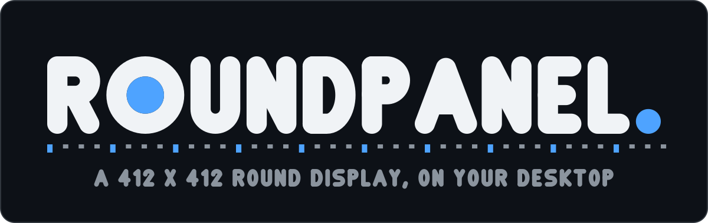
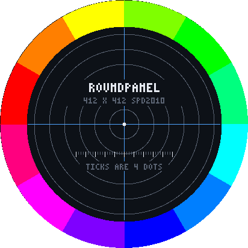
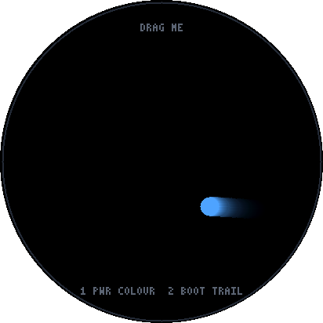

<p align="center">
  
</p>

---

A desktop emulator for the **ESP32-S3 Development Board With 1.46 Round Display
412 x 412** — Waveshare's ESP32-S3-Touch-LCD-1.46B. Write your application in
Rust, run it in a window the size and shape of the real round display, and every
frame goes out over an emulated QSPI bus to a software model of the board's
SPD2010 display controller before you see it. You do not need the hardware to
start, and when you do have it, the driver half of this repo is the same code
that would run on the ESP32-S3.

The board: [ESP32-S3 Development Board With 1.46 Round Display 412 x 412](https://thepihut.com/products/esp32-s3-development-board-with-1-46-round-display-412-x-412)
at The Pi Hut — a 1.46 inch, 412 x 412 round touch IPS module on an ESP32-S3,
with PWR and BOOT side buttons.

<p align="center">
  
  
</p>

Both pictures are the panel's own readback — drawn by the example, encoded,
sent as QSPI transfers, decoded by the chip model, and read back out of its RAM.
Neither was drawn to a canvas and screenshotted.

## Run it

You need [Rust](https://rustup.rs). Nothing else.

```sh
git clone https://github.com/Alchemy86/roundpanel-emu
cd roundpanel-emu
cargo run --release --example test-pattern
```

A window opens with the round screen in it and the board's two side keys beside
it. Mouse is the touch panel, `1` is PWR, `2` is BOOT, `S` writes a screenshot,
`Esc` quits.

```sh
cargo run --release --example bouncing-dot     # touch, keys, and a trail
cargo run --release --example test-pattern -- --scale 2 --format 565
```

No display? Every example takes `--shot`, which renders one frame headless and
writes the PNG — through the panel, same as the window:

```sh
cargo run --release --example bouncing-dot -- --shot out.png --frames 200
```

`--help` lists the rest (`--scale`, `--format`, `--fps`, `--bare`, `--at`).

## Write your own

Implement one method. `Frame` is the panel's whole framebuffer — 412 x 412, RGB,
one byte a channel — and `Ctx` is what the hardware would have told you.

```rust
use roundpanel::{rgb, App, Ctx, Frame, SideKey};

struct Hello { r: i32 }

impl App for Hello {
    fn draw(&mut self, f: &mut Frame, ctx: &Ctx) {
        let (cx, cy) = f.centre();
        f.clear(rgb(0x0d1117));
        f.ring(cx, cy, self.r, 6, rgb(0x4ea3ff));
        f.text_centred(cx, cy - 6, "HELLO", 4, rgb(0xe6eaf2));

        // Tap the glass and the ring follows your finger.
        for (x, y) in ctx.taps() {
            let (dx, dy) = ((x - cx) as f32, (y - cy) as f32);
            self.r = (dx * dx + dy * dy).sqrt() as i32;
        }
        if ctx.pressed(SideKey::Boot) {
            self.r = 60;
        }
    }
}

fn main() -> Result<(), String> {
    roundpanel::run_cli(Hello { r: 120 })
}
```

Add `roundpanel = { git = "https://github.com/Alchemy86/roundpanel-emu" }` to
your `Cargo.toml`, or copy `roundpanel/examples/bouncing-dot.rs` and start
editing. The full API is `cargo doc --open -p roundpanel`.

Testing it needs no window and no mouse:

```rust
let panel = roundpanel::render_frames(&mut app, 0, 120, 60, PixelFormat::Rgb888)?;
assert_eq!(&panel.dots()[(206 * 412 + 60) * 3..][..3], &[0xff, 0xb3, 0x4e]);
```

## What's in here

| | |
|---|---|
| `spd2010/` | the panel. A QSPI driver for the SPD2010 display controller, and a software model of the chip. `no_std`, `forbid(unsafe_code)`, no dependencies — the half that would go on the board |
| `roundpanel/` | the harness. Framebuffer, window, touch, the two side keys, screenshots, and the headless path |
| `roundpanel/examples/` | `test-pattern` and `bouncing-dot` — start from either |
| `brand/` | the logo, and the [Glyphsmith](https://github.com/Alchemy86/Glyphsmith) script that draws it |

## Why this is an emulator and not a canvas

Every frame is encoded to the interface pixel format, handed to the real driver,
decoded by a model of the controller, and read back out of that model's RAM.
Nothing reaches around it. So the desktop run tells you about the *panel*, and
the panel has opinions:

- **Columns come in fours.** `CASET`'s start column must be a multiple of four
  and its end one less than a multiple of four (datasheet p.48). A full-frame
  update is fine — 412 divides by four — but a partial update at an arbitrary x
  is not, and `Panel::present_region` snaps the window outwards rather than
  quietly moving your picture.
- **A whole frame may not go out on one `RAMWR`.** Page 50: "Cannot write whole
  frame data using 0x2C. Separate whole frame into several segment." The driver
  splits it and the model checks that it did.
- **There is no grey mode.** `COLMOD` offers 16.7M, 262k and 65k colour and
  nothing else. Run with `--format 565` and you are looking at what your palette
  becomes on the wire.
- **The buffer is square and the glass is round.** The controller addresses a
  rectangle; the module only lights the inscribed circle. The four corners are
  addresses with no dot behind them, and the window draws the circle only.

`spd2010/tests/protocol.rs` is 36 checks against the datasheet and the two real
drivers — Espressif's `esp_lcd_spd2010` and ESPHome's `mipi_spi` model for this
exact board — each naming the page or source line it comes from.

## Running on the real board — what is and is not covered

**Covered.** `spd2010` is the driver, not a host-side sketch of one. It is
`no_std`, allocation-free and generic over a `QspiBus` trait, so the code that
drew your frame on the desktop is the code that drives the panel on the board.
Frames, windowing, the alignment rule, the chunking, brightness, sleep and
`COLMOD` all come with it.

**Not covered, and you will have to write it.** This repo ships no ESP32-S3
firmware. To bring the panel up on hardware you still need:

- a `QspiBus` implementation over `esp-hal`'s SPI2 in quad mode, with the pins
  for this board;
- the reset release, which on this module goes through an IO expander rather
  than a GPIO;
- the vendor initialisation table — roughly 380 gamma, GIP and power register
  writes that the panel supplier provides and that nobody publishes. The driver
  takes it as a parameter (`Spd2010::init(format, vendor_table)`) and sends it
  in exactly the place both real drivers do;
- the delays, which a `no_std` driver has no clock for: 5 ms after `SWRESET` and
  120 ms across sleep transitions;
- the touch controller. The SPD2010 is a TDDI part, so the same die carries
  touch, but it speaks its own I2C bus and nothing here models it. On the
  desktop the mouse stands in for it.

It is also not an ESP32-S3 emulator. Your drawing code runs natively as a Rust
program on your machine — no Xtensa core, no FreeRTOS, no WiFi, no filesystem.

## Sources

- Solomon Systech, *L-WEA2010: 454x454 TDDI for IOT/Wearable*, Product Preview
  Rev 0.50 — every page citation in `spd2010/` is that document's printed page.
  Espressif publish it alongside their driver.
- Espressif's `esp_lcd_spd2010` component — the vendor's own driver.
- ESPHome's `mipi_spi` model `WAVESHARE-ESP32-S3-TOUCH-LCD-1.46` — the same init
  table reached independently, plus this board's 412x412 and `draw_rounding=4`.

The wordmark is drawn by [Glyphsmith](https://github.com/Alchemy86/Glyphsmith);
`python3 brand/make.py` regenerates it. No font is embedded, subset or traced.

MIT licensed. Not affiliated with Waveshare, The Pi Hut, Espressif or Solomon
Systech.
